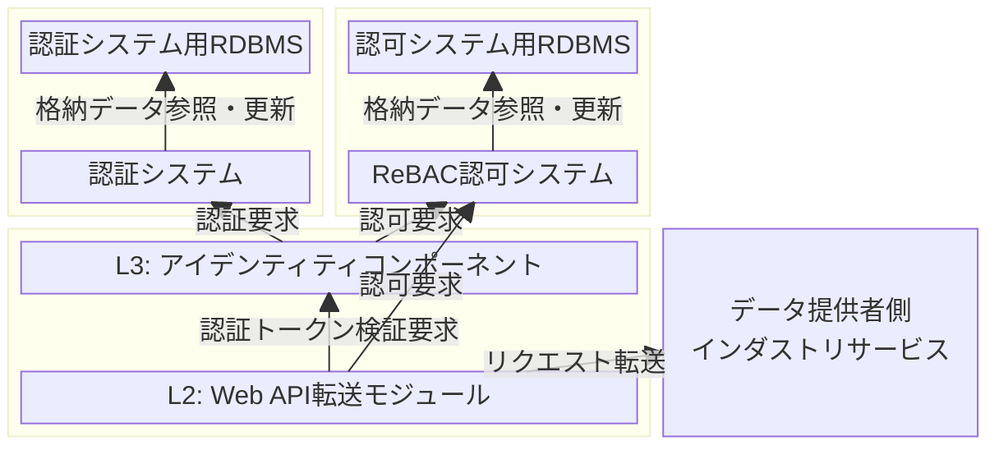
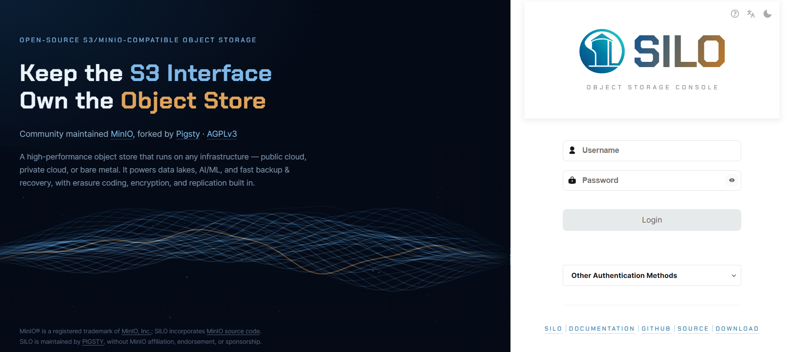
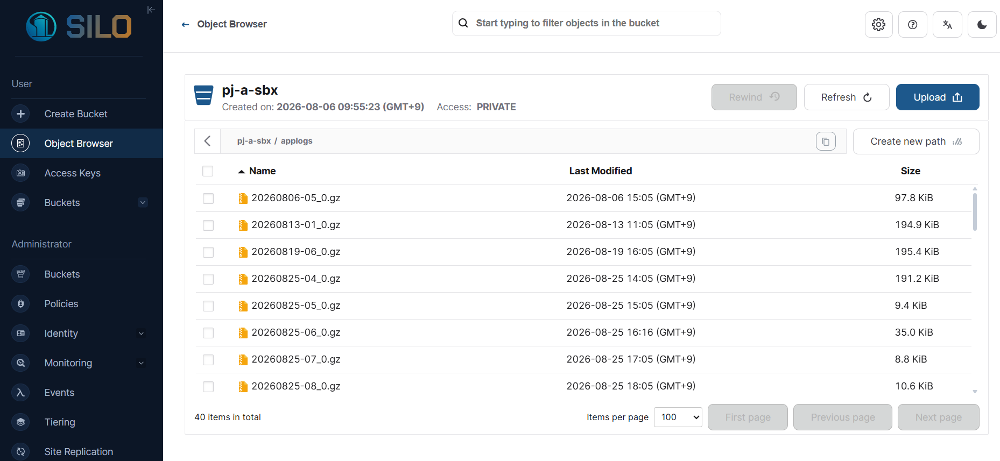
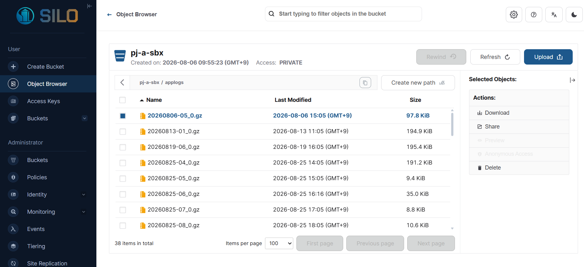

# ODS SDK for Onboarding デプロイ定義ファイル（Docker Compose用）

## 概要

本リポジトリでは、Open Dataspaces（以下ODS）が提供する SDK for Onbording の一つとして、Docker Compose 用のデプロイ定義ファイルを公開します。
これらの定義ファイルを使うことで、利用者は自身のローカル環境に ODS のコンポーネント群を容易に配備し、開発や動作確認に使用することができます。

## 前提条件

本リポジトリで公開しているソフトウェアは、以下の環境で動作確認を行っています。

* マシンスペック: Core i7-1265U, 16GiB Mem, 500GB SSD
* OS: Windows 11 + WSL2 (Ubuntu 24.04)
* Docker Client: 28.1.1-rd, Server: 27.3.1, Compose: 2.37.1

また、ODS コンポーネントは以下のバージョンを使用します。

* [Web API転送モジュール](https://github.com/open-dataspaces/L2-dp-webapi): [v1.0.0](https://github.com/open-dataspaces/L2-dp-webapi/tree/v1.0.0)
* [アイデンティティコンポーネント](https://github.com/open-dataspaces/L3-identity-component): [v1.0.0](https://github.com/open-dataspaces/L3-identity-component/tree/v1.0.0)
* [精算・課金／決済サービス](https://github.com/open-dataspaces/DCS-Payment): [v1.0.0](https://github.com/open-dataspaces/DCS-Payment/tree/v1.0.0)

## リポジトリ構成

本リポジトリのディレクトリ構成は以下の通りです。

| ファイル・ディレクトリ | 説明 |
| ------------------ | ---- |
| docker-compose.yml | 各コンポーネント用の定義を集約し、一括で起動・終了するためのデプロイ定義ファイル |
| l2                 | L2（トランザクションレイヤ）のコンポーネントである Web API転送モジュールのデプロイ定義ファイル格納先 |
| l3                 | L3（アイデンティティレイヤ）のコンポーネントであるアイデンティティコンポーネントのデプロイ定義ファイル格納先 |
| logging            | ロギングサービスのデプロイ定義ファイル格納先 |
| mockserver         | 動作確認用のモックサーバのデプロイ定義ファイル格納先 |
| payment            | 精算・課金／決済サービスのデプロイ定義ファイル格納先 |
| setup              | 構築手順を簡易化・自動化するためのスクリプト群 |

## 構築手順

### システム構成図

本SDKで構築するコンポーネント・サービスは以下の通りです。四角形がコンポーネントもしくはサービス、矢印はそれらの間の依存関係を表します。


```mermaid
block
  columns 3

  block:a:1
  columns 1
  AuthN_DB["認証システム用RDBMS"]
  space
  AuthN_SV["認証システム"]
  end

  block:b:1
  columns 1
  AuthZ_DB["認可システム用RDBMS"]
  space
  AuthZ_SV["ReBAC認可システム"]
  end

  space

  block:d:2
    columns 1
    L3["L3: アイデンティティコンポーネント"]
    space
    L2["L2: Web API転送モジュール"]
  end

  IS["データ提供者側\nインダストリサービス"]

AuthN_SV -- "格納データ参照・更新" --> AuthN_DB
AuthZ_SV -- "格納データ参照・更新" --> AuthZ_DB
L3 -- "認証要求" --> AuthN_SV
L3 -- "認可要求"--> AuthZ_SV
L2 -- "認証トークン検証要求"--> L3
L2 -- "認可要求"--> AuthZ_SV
L2 -- "リクエスト転送"--> IS
```

なお、本SDKではRDBMSとしてPostgreSQL、認証システムとしてKeycloak、ReBAC認可システムとしてOpenFGAを用います。
また以降では、アイデンティティコンポーネント・Web API転送モジュールを、それぞれ単にL3・L2と呼称する場合があります。

以下、特に断りがない限り、各コマンドは本リポジトリを `git clone` したルートディレクトリで実行するものとします。

### 起動・停止

各コンポーネントを個別に起動・停止する手順は以下の通りです。

#### L3: アイデンティティコンポーネント

起動

```
$ docker compose -f l3/docker-compose.yml up -d
```

停止

```
$ docker compose -f l3/docker-compose.yml down
```

#### ロギングサービス

起動

```
$ docker compose -f logging/docker-compose.yml up -d
```

停止

```
$ docker compose -f logging/docker-compose.yml down
```

#### L2: Web API転送モジュール

起動（事前にL3, ロギングの起動が必要）

```
$ docker compose up -d gateway 
```

停止

```
$ docker compose -f l2/docker-compose.yml down
```

#### 精算・課金／決済サービス

起動（事前にL3の起動が必要）

```
$ docker compose -f payment/docker-compose.yml up -d
```

停止

```
$ docker compose -f payment/docker-compose.yml down
```

### SSLインスペクション向けの設定について

SSLインスペクション環境で本リポジトリを使用する場合、コンテナイメージのビルド中にファイルのダウンロードに失敗する可能性があります。
その場合、インスペクションを通過するために必要な証明書を「cert-file/cert.cer」に配置し、Dockerfile 中の対応する箇所のコメントアウトを解除してください。
これらの対応が必要なファイルは以下の4つです。

- l2/Dockerfile
- l3/Dockerfile-local
- logging/Dockerfile
- payment/Dockerfile

### 各コンポーネントの初期設定

各コンポーネントの初期設定手順を以下に示します。

最初に、L2, L3, 精算決済の各サービスを、それぞれの公式リポジトリからコピーします。

```
$ git clone --branch=v1.0.0 --depth=1 https://github.com/open-dataspaces/L2-dp-webapi.git
$ git clone --branch=v1.0.0 --depth=1 https://github.com/open-dataspaces/L3-identity-component.git
$ git clone --branch=v1.0.0 --depth=1 https://github.com/open-dataspaces/DCS-Payment.git
```

必要なファイルが揃ったら、サービス群が共有するネットワークを作成し、リポジトリのトップレベルに配置されている docker-compose.yml ファイルを使ってすべてのサービスを起動します。

```
$ docker network create shared-network-ods
$ docker compose up -d
```

以下のように、全サービスが起動したら成功です。

```
[+] Running 17/17
 ✔ gateway                      Built                                                            0.0s
 ✔ payment-app                  Built                                                            0.0s
 ✔ l3-app                       Built                                                            0.0s
 ✔ Volume "ods_pgdata"          Created                                                          0.0s
 ✔ Volume "ods_postgres_data"   Created                                                          0.0s
 ✔ Volume "ods_pgdata_openfga"  Created                                                          0.0s
 ✔ Container silo              Started                                                          1.0s
 ✔ Container postgres           Started                                                          1.1s
 ✔ Container fluentd            Started                                                          1.1s
 ✔ Container l3-app             Started                                                          1.0s
 ✔ Container payment-db         Healthy                                                         11.5s
 ✔ Container postgres-openfga   Started                                                          1.0s
 ✔ Container payment-app        Started                                                         12.0s
 ✔ Container keycloak           Started                                                          1.7s
 ✔ Container openfga            Started                                                          1.6s
 ✔ Container ods-silo-init-1   Started                                                          1.4s
 ✔ Container gateway            Started                                                          2.2s
```

この状態から、コンポーネント別の初期設定を行います。

#### L3: アイデンティティコンポーネント

L3では、[サービス起動](https://github.com/open-dataspaces/L3-identity-component/tree/v1.0.0?tab=readme-ov-file#1-%E3%82%B5%E3%83%BC%E3%83%93%E3%82%B9%E8%B5%B7%E5%8B%95)および[参考実装チュートリアル](https://github.com/open-dataspaces/L3-identity-component/blob/v1.0.0/docs/tutorials/tutorials.md)に示す初期設定が必要です。
本SDKでは、後者の「[2. ユーザ認証システム動作確認](https://github.com/open-dataspaces/L3-identity-component/blob/v1.0.0/docs/tutorials/tutorials.md#2-%E3%83%A6%E3%83%BC%E3%82%B6%E8%AA%8D%E8%A8%BC%E3%82%B7%E3%82%B9%E3%83%86%E3%83%A0%E5%8B%95%E4%BD%9C%E7%A2%BA%E8%AA%8D)」までを一括で実施するスクリプトを提供しています。実行方法は以下の通りです。

```
$ cd setup
$ bash setup_l3.sh
$ cd -
$ docker compose -f l3/docker-compose.yml up -d
```

上記の手順で Keycloak に作成される2つのクライアントID（クライアントシステム認証およびユーザ当人認証）は、[2. ユーザ認証システム動作確認](https://github.com/open-dataspaces/L3-identity-component/blob/v1.0.0/docs/tutorials/tutorials.md#2-%E3%83%A6%E3%83%BC%E3%82%B6%E8%AA%8D%E8%A8%BC%E3%82%B7%E3%82%B9%E3%83%86%E3%83%A0%E5%8B%95%E4%BD%9C%E7%A2%BA%E8%AA%8D) で作成されるものと同一です。
変更する場合は setup/setup_l3.sh を編集してください。

次に以下のコマンドを実行することで、OpenFGA のストア及び認可モデルを作成し、その内容をL2のデプロイ定義ファイル (l2/docker-compose.yml) に反映します。

```
$ cd setup
$ bash setup_l2.sh
$ cd -
```

上記の手順で OpenFGA に作成されるストア名は "ODS-USER-STORE" です。変更する場合は setup/openfga/5-create-user-store.json を編集してください。

#### L2: Web API転送モジュール

上記の手順を行うことで、L2 の起動に必要な設定はデプロイ定義ファイルに反映されているため、追加で必要な設定はありません。


## 運用構築

### 事前準備

アクセストークンの有効時間はデフォルトで60秒ですが、短い場合は必要に応じて延長します。
有効時間を300秒に延長する例を以下に示します。

```
$ ADMIN_ACCESS_TOKEN=$(
  curl -s -X POST "http://localhost:8082/realms/master/protocol/openid-connect/token" \
    -H "Content-Type: application/x-www-form-urlencoded" \
    -d "grant_type=password" \
    -d "client_id=admin-cli" \
    -d "username=admin" \
    -d "password=password" | jq -r .access_token
)

$ curl -X PUT "http://localhost:8082/admin/realms/master" \
    -H "Authorization: Bearer ${ADMIN_ACCESS_TOKEN}" \
    -H "Content-Type: application/json" \
    -d '{"accessTokenLifespan": 300}'
```

### 運用開始に向けた各種データ設定

[参考実装チュートリアル 2-1. 認証情報の作成（事業者情報/個人ユーザ/クライアントID）](https://github.com/open-dataspaces/L3-identity-component/blob/v1.0.0/docs/tutorials/tutorials.md#2-1-%E8%AA%8D%E8%A8%BC%E6%83%85%E5%A0%B1%E3%81%AE%E4%BD%9C%E6%88%90%E4%BA%8B%E6%A5%AD%E8%80%85%E6%83%85%E5%A0%B1%E5%80%8B%E4%BA%BA%E3%83%A6%E3%83%BC%E3%82%B6%E3%82%AF%E3%83%A9%E3%82%A4%E3%82%A2%E3%83%B3%E3%83%88id)に記載の手順に従い、事業者情報の登録から[2-1-5. 事業者クライアントシークレット取得](https://github.com/open-dataspaces/L3-identity-component/blob/v1.0.0/docs/tutorials/tutorials.md#2-1-5-%E4%BA%8B%E6%A5%AD%E8%80%85%E3%82%AF%E3%83%A9%E3%82%A4%E3%82%A2%E3%83%B3%E3%83%88%E3%82%B7%E3%83%BC%E3%82%AF%E3%83%AC%E3%83%83%E3%83%88%E5%8F%96%E5%BE%97)までを実行してください。宛先のホストには localhost:8080 を指定してください。また、本手順で必要な `$SYSTEM_CLIENT_SECRET` には、l3/docker-compose.yml の以下の設定値を、`API-Key`は`API-Key-Sample`を、`client_id`には`system-auth-sample`指定してください。

```
KEYCLOAK_CREDENTIALS_TOKEN_INTROSPECT_CLIENT_SECRET
```

### コンポーネント間の環境設定

L2がL3と連携できるよう、l2/docker-compose.yml の以下の項目に認証システム (Keycloak) の URLを設定してください。
なお、本SDKで用意している docker-compose.yml では、L3の設定に合わせた値が既に設定されています。何らかの理由でL3のURLを変更した場合は下記の値を変更してください。

```
KEYCLOAK_URL
```

### インダストリサービス連携方法

データ提供者側のインダストリサービスと連携するために必要な設定は以下の通りです。
なお本手順では、インダストリサービスの例として用意したモックサーバに対する通信を許可する例を示します。 

#### L3: アイデンティティコンポーネント

##### OpenFGAストアへのタプル登録

以下のコマンドを実行して、インダストリサービスに対する認可タプルを OpenFGA のストアに登録します。 
コマンド中の変数には以下の値を指定してください。

| 変数 | 値 |
|---|---|
| `$USER_STORE_ID` | l2/docker-compose.yml 内の `FGA_STORE_ID` の設定値 |

```
$ curl -i -X POST \
  http://localhost:8083/stores/$USER_STORE_ID/write \
  -H "Content-Type: application/json" \
  -d '{
  "writes": {
    "tuple_keys": [
      { "user": "group:endpoint-test-get#member",    "relation": "can_access", "object": "endpoint:test.get" },
      { "user": "group:endpoint-test-post#member",   "relation": "can_access", "object": "endpoint:test.post" },
      { "user": "group:endpoint-test-put#member",    "relation": "can_access", "object": "endpoint:test.put" },
      { "user": "group:endpoint-test-delete#member", "relation": "can_access", "object": "endpoint:test.delete" }
    ],
    "on_duplicate": "ignore"
  }
}'
```

ここでは、インダストリサービスが公開する endpoint に対して、CRUD の各操作ごとに権限グループを作成しています。
たとえば tuple_keys 内の1行目は、「グループ endpoint-test-get のメンバーであるユーザは、対象のエンドポイント test.get に対してアクセス可能な関係 (can_access) である」ことを意味しています。
ここでオブジェクト中のエンドポイント「test.get」は、後述するL2の設定において定義されるルート（インダストリサービスへのリクエスト転送先）に対応しています。
同様に2～4行目も、「グループ endpoint-test-post/put/delete のメンバーであるユーザは、それぞれエンドポイント test.post/put/delete にアクセスできる」ことを表しています。

##### 事業者への認可付与

次に、インダストリサービスに対する事業者の認可設定をストアに登録するため、以下のコマンドを実行します。
コマンド中の変数には以下の値を指定してください。

| 変数 | 値 |
|---|---|
| `$USER_STORE_ID` | l2/docker-compose.yml 内の `FGA_STORE_ID` の設定値 |
| `$USER_MODEL_ID` | l2/docker-compose.yml 内の `FGA_MODEL_ID` の設定値 |
| `$OPERATOR_ID` | 事業者情報の登録（上述）で発行された `operator_id` |

```
$ curl -i -X POST "http://localhost:8083/stores/$USER_STORE_ID/write" \
      -H "Content-Type: application/json" \
      -d '{
        "authorization_model_id": "'$USER_MODEL_ID'",
        "writes": {
          "tuple_keys": [
            {
              "user": "user:'$OPERATOR_ID'",
              "relation": "member",
              "object": "group:endpoint-test-post"
            }
          ]
        }
      }'
```

ここでは、事業者をインダストリサービスに post を送る権限を持つグループに追加しています。
付与する権限を変更する際は、`object` プロパティの値を対応するグループに置き換えて実行してください。

なお、前手順のOpenFGAストアへのタプル登録と本手順についてはL3のOpenFGAに対して直接リクエストを送っています。OpenFGAに対して直接リクエストを送ることができない場合は[参考実装チュートリアル 2-4. 認可機能利用](https://github.com/open-dataspaces/L3-identity-component/blob/v1.0.0/docs/tutorials/tutorials.md#2-4-%E8%AA%8D%E5%8F%AF%E6%A9%9F%E8%83%BD%E5%88%A9%E7%94%A8)を参考に、L3 ユーザ認証システムを経由してリクエストを送信してください。

#### L2: Web API転送モジュール

L2 では、l2/docker-compose.yml への情報反映（OpenFGA ストア名および認可モデル名）と変更の適用、およびルート設定が必要です。
このうち情報反映については、初期設定手順中にある setup/setup_l2.sh を実行していれば、l2/docker-compose.yml が自動で編集されるため実施は不要です。
もし setup/setup_l2.sh を実行せずに OpenFGA ストアと認可モデルを作成した場合は、l2/docker-compose.yml 中の以下のパラメータに、作成したストアと認可モデルのIDをそれぞれ指定してください。

```
FGA_STORE_ID=
FGA_MODEL_ID=
```

以下のコマンドでL2を再起動し、設定の変更を適用します。

```
$ docker compose up -d gateway 
```

次に、インダストリサービスにリクエストを転送するための、ルートの設定を行います。
ここではモックサーバに対する通信を POST のみ許可する例を示します。以下のコマンドを実行してください。

```
$ curl -X POST\
    -H "Content-Type: application/json"\
    -H "X-API-KEY: your-secret-management-api-key"\
    -d '{
    "id": "route01",
    "uri": "http://mockoon:4011/test",
    "predicates": [{
        "name": "Path",
        "args": {
        "_genkey_0": "/test**"
         }
     },
      { 
        "name": "Method",
        "args": { 
        "_genkey_0": "POST"
         }
      }],
    "metadata": {
      "endpointId": "test.post"
     }    
    }'\
    http://localhost:8090/actuator/gateway/routes/route01
```

上記のコマンドを実行することで、データ利用者からの「http://(L2のFQDN)/test」に対するリクエストが、フィールド "uri" に指定されたインダストリサービスのURL (ここでは http://mockoon:4011/test) に転送されるようになります。
ここでメタデータとして指定している "endpointId" の値 "test.post" は、OpenFGA に object として登録したエンドポイント "endpoint:test.post" に対応しています。
これにより、OpenFGA でグループ group:endpoint-test-post に所属しているユーザであれば、本URLにPOSTメソッドを送信できるようになります。

なお、ルートの登録時には、公開するパスの変更やヘッダの追加・削除などが可能です。下の例を参考に、必要な設定を上記の送信データに追加してください。

```
    "filters": [
    {
        "name": "RewritePath",
        "args": {
        "_genkey_0": "/外部に公開するアドレス/(?<segment>.*)",
        "_genkey_1": "/${segment}"
         }
    },
    {
        "name": "AddRequestHeader",
        "args": {
            "name": "インダストリサービスで利用する任意のヘッダ名",
            "value": "任意の値"
        }
    },
    {
        "name": "RemoveRequestHeader",
        "args": {
        "name": "インダストリサービスで不要なヘッダ名"
         }
    }],
```

#### データ利用者

データ利用者は、以下のHTTPヘッダをリクエストに設定する必要があります。
インダストリサービスへのアクセスの際に必要なヘッダ情報は以下です。

| ヘッダー名 | 内容 |
|---:|---|
| API-Key | 本サービスから払い出されたAPIキー |
| Authorization | L3(アイデンティティコンポーネントで発行したアクセストークン (JWT形式))  |
| X-TrackingId | 来歴管理⽤ログ出⼒項⽬ (UUID形式) |
| X-ODS-xxx | ロギング対象項目。xxxにはサービス提供者などから指定された文字列を指定（例：X-ODS-UserId） |

#### データ提供者

データ提供者は設定したルート設定に対応したインダストリサービスを立ち上げます。  
本手順では例としてモックサーバを使用します。起動コマンドは以下の通りです。

```
$ docker compose -f mockserver/docker-compose.yml up -d
```

### データ交換

本リポジトリのデプロイ定義ファイルで配備されるコンポーネント群、およびそれらと連携するインダストリサービスを用いて、利用者と提供者との間でデータ交換を行う手順を以下に示します。

1. アクセストークンの取得  
  [L3 参考実装チュートリアル 2-2-1. アクセストークン取得（事業者クライアントID認証）](https://github.com/open-dataspaces/L3-identity-component/blob/v1.0.0/docs/tutorials/tutorials.md#2-2-1-%E3%82%A2%E3%82%AF%E3%82%BB%E3%82%B9%E3%83%88%E3%83%BC%E3%82%AF%E3%83%B3%E5%8F%96%E5%BE%97%E4%BA%8B%E6%A5%AD%E8%80%85%E3%82%AF%E3%83%A9%E3%82%A4%E3%82%A2%E3%83%B3%E3%83%88id%E8%AA%8D%E8%A8%BC)を実施しアクセストークンを取得します。なお、宛先のホストには localhost:8080 を、`API-Key`は`API-Key-Sample`を指定してください。

2. データアクセス  
  取得したアクセストークンを用いてデータアクセスを実施します。
  ルート登録で設定したインダストリサービスに対してPOSTを実行する場合は以下を実行してください。

    ```
    $ curl -X POST "http://localhost:8090/test" \
      -H 'api-key: 2dfd3409-ce01-4451-96fa-7e10c9681422y' \
      -H "Authorization: Bearer $ACCESS_TOKEN" \
      -H 'X-ODS-UserId: 112233' \
      -H "Content-Type: application/json" \
      -H "Prefer: return=representation" \
      -d '{"userid":112233}' | jq .
    ```
    /testエンドポイントから、以下のようなレスポンスが返却されます。
    ```
    {
      "message": "Request successfully delivered!"
    }
    ```

### 精算・課金／決済

精算・課金／決済サービスでは、データ提供者が登録した利用料モデルに従い、利用者と提供者の間で行われたデータ交換の履歴に基づいて両者への支払／請求額を計算し提示する機能と、外部サービスと連携して実際の決済を行う機能を提供します。取引の実績は利用者・提供者の双方から登録するとともに、Web API転送モジュールから収集したログ情報とも突合することで、正当性を担保します。詳細は[精算・課金／決済サービスのドキュメント](https://github.com/open-dataspaces/DCS-Payment)を参照してください。

#### 事前準備

##### ログ取得用コンテナイメージのビルド

本手順ではL2のログを取得し実際にデータの授受を行ったのかの確認を行います。
その際に利用するL2Transactionチェックのコンテナイメージをビルドします。

```
$ docker build \
    -t ods-payment-checkl2log:latest \
    -f payment/Dockerfile.checkl2log \
    .
```

なお、こちらのイメージビルド時にもSSLインスペクション向けの設定が必要の場合、[SSLインスペクション向けの設定について](https://github.com/open-dataspaces/SDK-docker-compose#ssl%E3%82%A4%E3%83%B3%E3%82%B9%E3%83%9A%E3%82%AF%E3%82%B7%E3%83%A7%E3%83%B3%E5%90%91%E3%81%91%E3%81%AE%E8%A8%AD%E5%AE%9A%E3%81%AB%E3%81%A4%E3%81%84%E3%81%A6)と同様にDockerfile 中の対応する箇所のコメントアウトを解除してください。

##### 事業者クライアント作成

精算決済サービスの動作には、データ提供者とデータ利用者の二つの事業者クライアントが必要になります。[参考実装チュートリアル 2-1. 認証情報の作成（事業者情報/個人ユーザ/クライアントID）](https://github.com/open-dataspaces/L3-identity-component/blob/v1.0.0/docs/tutorials/tutorials.md#2-1-%E8%AA%8D%E8%A8%BC%E6%83%85%E5%A0%B1%E3%81%AE%E4%BD%9C%E6%88%90%E4%BA%8B%E6%A5%AD%E8%80%85%E6%83%85%E5%A0%B1%E5%80%8B%E4%BA%BA%E3%83%A6%E3%83%BC%E3%82%B6%E3%82%AF%E3%83%A9%E3%82%A4%E3%82%A2%E3%83%B3%E3%83%88id)に記載の事業者情報の登録から[2-1-5. 事業者クライアントシークレット取得](https://github.com/open-dataspaces/L3-identity-component/blob/v1.0.0/docs/tutorials/tutorials.md#2-1-5-%E4%BA%8B%E6%A5%AD%E8%80%85%E3%82%AF%E3%83%A9%E3%82%A4%E3%82%A2%E3%83%B3%E3%83%88%E3%82%B7%E3%83%BC%E3%82%AF%E3%83%AC%E3%83%83%E3%83%88%E5%8F%96%E5%BE%97)までを実行し、データ提供者とデータ利用者の事業者クライアントをそれぞれ作成してください。
なお、ここで以降の処理では作成したデータ提供者、利用者のクライアントidはそれぞれ `PROVIDER_ID`, `CONSUMER_ID`として使用します。

##### 認可設定

精算決済サービスの動作確認では、実際にL2を通してインダストリサービスからデータの授受を行う必要があります。そのため、L3,L2のそれぞれに対して認可登録とルート設定が必要になります。本手順では認可制御及びルート設定の一例を示します。

##### OpenFGAへのタプル登録

以下のコマンドを実行して、インダストリサービスに対する認可タプルを OpenFGA のストアに登録します。 コマンド中の変数には以下の値を指定してください。なお、本SDKの[運用構築 OpenFGAストアへのタプル登録](https://github.com/open-dataspaces/SDK-docker-compose#openfga%E3%82%B9%E3%83%88%E3%82%A2%E3%81%B8%E3%81%AE%E3%82%BF%E3%83%97%E3%83%AB%E7%99%BB%E9%8C%B2)を実行済の場合は本手順の実行は不要です。

| 変数 | 値 |
|---|---|
| `$USER_STORE_ID` | l2/docker-compose.yml 内の `FGA_STORE_ID` の設定値 |

```
$ curl -i -X POST http://localhost:8083/stores/$USER_STORE_ID/write \
  -H "Content-Type: application/json" \
  -d '{
  "writes": {
    "tuple_keys": [
      {
	      "user": "group:endpoint-test-get#member",
	      "relation": "can_access",
	      "object": "endpoint:test.get"
		  }
    ],
    "on_duplicate": "ignore"
  }
}'
```

##### 事業者への認可付与

次に、インダストリサービスに対する事業者の認可設定をストアに登録するため、以下のコマンドを実行します。 コマンド中の変数には以下の値を指定してください。

| 変数 | 値 |
|---|---|
| `$USER_STORE_ID` | l2/docker-compose.yml 内の `FGA_STORE_ID` の設定値 |
| `$USER_MODEL_ID` | l2/docker-compose.yml 内の `FGA_MODEL_ID` の設定値 |
| `$PROVIDER_ID` | 事業者クライアント作成（上述）で発行されたデータ提供者の `operator_id` |
| `$COMSUMER_ID` | 事業者クライアント作成（上述）で発行されたデータ利用者の `operator_id` |

```
$ curl -i -X POST http://localhost:8083/stores/$USER_STORE_ID/write \
  -H "Content-Type: application/json" \
  -d '{
    "authorization_model_id": "'$USER_MODEL_ID'",
    "writes": {
	  	"tuple_keys": [
	    	{ "user": "user:'$PROVIDER_ID'", "relation": "member", "object": "group:endpoint-test-get" },
			  { "user": "user:'$CONSUMER_ID'", "relation": "member", "object": "group:endpoint-test-get" }
 			 ],
			"on_duplicate": "ignore"
		}
  }'
```

##### データへのアクセスルートの設定

[インダストリサービス連携方法 L2: Web API転送モジュール](https://github.com/open-dataspaces/SDK-docker-compose#l2-web-api%E8%BB%A2%E9%80%81%E3%83%A2%E3%82%B8%E3%83%A5%E3%83%BC%E3%83%AB-2)を参考に、L2に通信結果のログを残すためのルート設定を実施します。ここではモックサーバに対する通信を GET のみ許可します。以下のコマンドを実行してください。

```
$ curl -X POST\
    -H "Content-Type: application/json"\
    -H "X-API-KEY: your-secret-management-api-key"\
    -d '{
    "id": "route02",
    "uri": "http://mockoon:4011/test",
    "predicates": [{
        "name": "Path",
        "args": {
        "_genkey_0": "/test**"
         }
     },
      { 
        "name": "Method",
        "args": { 
        "_genkey_0": "GET"
         }
      }],
    "metadata": {
      "endpointId": "test.get"
     }    
    }'\
    http://localhost:8090/actuator/gateway/routes/route02
```

#### 精算決済処理

1. 精算・課金／決済データベースのマイグレーションを実行します。

```
$ cd DCS-Payment
$ docker compose exec payment-app alembic -c migrations/alembic.ini upgrade head

...

INFO  [alembic.runtime.migration] Context impl PostgresqlImpl.
INFO  [alembic.runtime.migration] Will assume transactional DDL.
INFO  [alembic.runtime.migration] Running upgrade  -> 001_initial, Initial tables - 全テーブル統合版
$ cd -
```

2. payment/docker-compose.yml 中の以下のパラメータに, l3/docker-compose.yml 中の `KEYCLOAK_CREDENTIALS_TOKEN_INTROSPECT_CLIENT_SECRET` と同じ値を設定し、精算・課金／決済サービスを再起動して反映します。
   なお、今回は説明を簡潔にするため、精算・課金／決済サービスの認可機能を無効化しています。実運用システムでは、[精算・課金／決済サービスのドキュメント](https://github.com/open-dataspaces/DCS-Payment)を参照の上、認可機能を適切に設定してください。

```
L3_CLIENT_SECRET
```

```
$ docker compose up payment-app -d
```

3. あらかじめ、動作確認用にダミーの決済サービスと、その決済サービスに紐付けられたデータ提供者・データ利用者をDBに登録します。登録したサービスのIDを変数に記憶しておきます。

```
$ PAYMENT_SERVICE_ID=$(uuidgen -t)
$ docker exec -it payment-db psql fastapi_db -U postgres -c "INSERT INTO payment_services VALUES ('$PAYMENT_SERVICE_ID', 'test_service', 'http://example.com/')"
INSERT 0 1
$ docker exec -it payment-db psql fastapi_db -U postgres -c 'SELECT * FROM payment_services'
          payment_service_id          | payment_service_name | payment_service_url |          created_at           |          updated_at           
--------------------------------------+----------------------+---------------------+-------------------------------+-------------------------------
 742b9b34-7901-11f1-b3c8-00155d3ea7f5 | test_service         | http://example.com/ | 2026-07-06 06:24:53.613416+00 | 2026-07-06 06:24:53.613416+00
(1 row)

$ docker exec -it payment-db psql fastapi_db -U postgres -c "INSERT INTO payment_service_user_registrations VALUES ('$PROVIDER_ID', '$PAYMENT_SERVICE_ID', '$CONSUMER_ID', '$PROVIDER_ID')"
INSERT 0 1
$ docker exec -it payment-db psql fastapi_db -U postgres -c '\x' -c 'SELECT * FROM payment_service_user_registrations'
Expanded display is on.
-[ RECORD 1 ]-----------+-------------------------------------
payment_service_user_id | bb20ce94-911e-4215-ad03-16b9dcc5784c
payment_service_id      | 742b9b34-7901-11f1-b3c8-00155d3ea7f5
consumer_id             | 99183994-9a21-42ec-8a49-5f4407038a5e
provider_id             | bb20ce94-911e-4215-ad03-16b9dcc5784c
company_name            | 
department              | 
customer_name           | 
zip_code                | 
address                 | 
tel_no                  | 
external_buyer_id       | 
external_data           | 
created_at              | 2026-07-06 06:25:55.623816+00
updated_at              | 2026-07-06 06:25:55.623816+00
```

4. [L3 参考実装チュートリアル 2-2-1. アクセストークン取得（事業者クライアントID認証）](https://github.com/open-dataspaces/L3-identity-component/blob/v1.0.0/docs/tutorials/tutorials.md#2-2-1-%E3%82%A2%E3%82%AF%E3%82%BB%E3%82%B9%E3%83%88%E3%83%BC%E3%82%AF%E3%83%B3%E5%8F%96%E5%BE%97%E4%BA%8B%E6%A5%AD%E8%80%85%E3%82%AF%E3%83%A9%E3%82%A4%E3%82%A2%E3%83%B3%E3%83%88id%E8%AA%8D%E8%A8%BC)を実行し、アクセストークンを取得します。宛先のホストには localhost:8080 を、`API-Key`は`API-Key-Sample`を指定してください。以降の処理ではデータ提供者のアクセストークンを `PROVIDER_ACCESS_TOKEN`, データ利用者のアクセストークンを`CONSUMER_ACCESS_TOKEN` とします。

##### 利用料モデル登録（提供者）

以下のリクエストを送信し、精算・課金／決済サービスに利用料モデルを登録します。

```
$ curl -X POST \
  -H "Content-Type: application/json" \
  -H "Authorization: Bearer $PROVIDER_ACCESS_TOKEN" \
  -H "X-TrackingId: $(uuidgen -t)" \
  -H "x-payment-api-key: payment-api-key" \
  -H "Accept-Language: ja-JP" \
  -H "User-Agent: payment-test" \
  -d '{
    "valid_from": "2026-07-01T00:00:00Z",
    "provider_id": "'"$PROVIDER_ID"'",
    "consumer_id": "'"$CONSUMER_ID"'",
    "data_id": "'"I0101"'",
    "payment_service_id": "'"$PAYMENT_SERVICE_ID"'",
    "fee_model_name": "通常モデル",
    "price": "1000.00",
    "tax_classification": "taxable",
    "tax_rate": "0.10",
    "is_active": true,
    "version": 1
  }' \
  localhost:8001/api/v1/fee-model
```

成功すると、以下のようなレスポンスが返却されます。

```
{
  "created_at":"2026-07-06T06:25:57.065456Z",
  "updated_at":"2026-07-06T06:25:57.065456Z",
  "valid_from":"2026-07-01T00:00:00Z",
  "is_active":true,
  "version":1,
  "storage_type":"provider_env",
  "storage_key":"","valid_to":null,
  "provider_id":"bb20ce94-911e-4215-ad03-16b9dcc5784c","consumer_id":"99183994-9a21-42ec-8a49-5f4407038a5e",
  "data_id":"I0101",
  "payment_service_id":"742b9b34-7901-11f1-b3c8-00155d3ea7f5",
  "fee_model_name":"通常モデル",
  "price":"1000.00",
  "tax_classification":"taxable",
  "tax_rate":"0.1000",
  "fee_model_id":"e819cad0-959a-4ebf-8455-cbadc24732e4"
}
```

##### 利用料モデル一覧取得（提供者）

登録した利用料モデルは、以下のリクエストで確認できます。

```
$ curl -s \
  -H "Content-Type: application/json" \
  -H "Authorization: Bearer $PROVIDER_ACCESS_TOKEN" \
  -H "X-TrackingId: $(uuidgen -t)" \
  -H "x-payment-api-key: payment-api-key" \
  localhost:8001/api/v1/fee-model
```

成功すると、以下のようなレスポンスが返却されます。

```
{
  "models":[
      {
        "created_at":"2026-07-06T06:25:57.065456Z",
        "updated_at":"2026-07-06T06:25:57.065456Z",
        "valid_from":"2026-07-01T00:00:00Z",
        "is_active":true,
        "version":1,
        "storage_type":"provider_env",
        "storage_key":"",
        "valid_to":null,
        "provider_id":"bb20ce94-911e-4215-ad03-16b9dcc5784c",
        "consumer_id":"99183994-9a21-42ec-8a49-5f4407038a5e",
        "data_id":"I0101",
        "payment_service_id":"742b9b34-7901-11f1-b3c8-00155d3ea7f5",
        "fee_model_name":"通常モデル",
        "price":"1000.00",
        "tax_classification":"taxable",
        "tax_rate":"0.1000",
        "fee_model_id":"e819cad0-959a-4ebf-8455-cbadc24732e4"
      }
    ]
}
```

##### データ交換の実行（利用者）

事前準備で登録したルートを利用してデータ交換を行います。  
精算決済で管理するデータ交換は、交換時に使用する `X-TrackingId` ヘッダ値で識別します。この例ではダミーの値を使用します。このIDは後の処理でも利用するため、環境変数へ格納します。
実行するコマンドは以下です。

```
$ export TRACKING_ID=$(uuidgen -t)
$ curl -X GET "http://localhost:8090/test" \
  -H 'api-key: 2dfd3409-ce01-4451-96fa-7e10c9681422y' \
  -H "Authorization: Bearer $CONSUMER_ACCESS_TOKEN" \
  -H "X-TrackingID: $TRACKING_ID" \
  -H 'X-ODS-UserId: 112233' \
  -H "Prefer: return=representation"
```

/testエンドポイントから、以下のようなレスポンスが返却されれば完了です。

```
{
  "message": "Request successfully delivered!"
}
```

##### データ交換状態登録（利用者・提供者）

データ交換が終了したタイミングで、利用者・提供者の双方から取引の実績を精算・課金／決済サービスに登録します。

###### 提供者の実行

```
$ curl -X POST \
  -H "Content-Type: application/json" \
  -H "Authorization: Bearer $PROVIDER_ACCESS_TOKEN" \
  -H "X-TrackingId: $(uuidgen -t)" \
  -H "x-payment-api-key: payment-api-key" \
  -H "Accept-Language: ja-JP" \
  -H "User-Agent: payment-test" \
  -d '{
    "tracking_id": "'"$TRACKING_ID"'",
    "provider_id": "'"$PROVIDER_ID"'",
    "consumer_id": "'"$CONSUMER_ID"'",
    "data_id_list": ["I0101"],
    "completed_at": "'$(date -Iseconds -u)'",
    "status": "completed"
  }' \
  localhost:8001/api/v1/data-exchange/status
```

登録に成功すると、以下のレスポンスが返却されます。

```
{"status":"success","detail":"Data exchange status registered"}
```

###### 利用者の実行

```
$ curl -X POST \
  -H "Content-Type: application/json" \
  -H "Authorization: Bearer $CONSUMER_ACCESS_TOKEN" \
  -H "X-TrackingId: $(uuidgen -t)" \
  -H "x-payment-api-key: payment-api-key" \
  -H "Accept-Language: ja-JP" \
  -H "User-Agent: payment-test" \
  -d '{
    "tracking_id": "'"$TRACKING_ID"'",
    "provider_id": "'"$PROVIDER_ID"'",
    "consumer_id": "'"$CONSUMER_ID"'",
    "data_id_list": ["I0101"],
    "completed_at": "'$(date -Iseconds -u)'",
    "status": "completed"
  }' \
  localhost:8001/api/v1/data-exchange/status
```

登録に成功すると、以下のレスポンスが返却されます。

```
{"status":"success","detail":"Data exchange completed for tracking_id: 75fdadfa-7909-11f1-b3c8-00155d3ea7f5"}
```

##### L2Transactionチェック

精算決済機能では、AWS S3のバケットからL2のログを抽出し整合性の確認を行います。
本SDKでは1時間毎にL2のログをSiloのバケットに保存しています。すぐに確認を行う場合は、fluentdを再起動して強制的にローテーションを行ってください。実行手順は以下です。

```
$ docker compose restart fluentd
```

本番環境では、整合性チェックは cron などで定期実行してください。
本SDKではS3互換のSiloに対してL2Transactionチェックを一度実行する例を示します。

```
$ docker run --rm \
  --network shared-network-ods \
  -e POSTGRES_HOST=payment-db \
  -e POSTGRES_PORT=5432 \
  -e POSTGRES_DB=fastapi_db \
  -e POSTGRES_USER=postgres \
  -e POSTGRES_PASSWORD=postgres \
  -e S3_BUCKET=pj-a-sbx \
  -e S3_PREFIX=applogs/ \
  -e AWS_ACCESS_KEY_ID=minio-sample \
  -e AWS_SECRET_ACCESS_KEY=XXXXXXXXXXXXXXXXXXXXXXXXXXXXXXXXX \
  -e AWS_DEFAULT_REGION=ap-northeast-1 \
  -e AWS_ENDPOINT_URL=http://silo:9000 \
  ods-payment-checkl2log:latest
```

実行が完了すると以下のように表示されます。

```
2026-07-06T07:53:09+0000 [INFO] === CronJob 開始 ===
2026-07-06T07:53:09+0000 [INFO] 対象バケット: pj-a-sbx / プレフィックス: applogs/
2026-07-06T07:53:09+0000 [INFO] 対象日付: 2026-07-05, 2026-07-06 (JST)
2026-07-06T07:53:09+0000 [INFO] DB から tracking_id を取得中 (2026-07-05 〜 2026-07-06)
2026-07-06T07:53:09+0000 [INFO] DB から 1 件の tracking_id を取得
2026-07-06T07:53:09+0000 [DEBUG] DB 接続クローズ
2026-07-06T07:53:10+0000 [INFO] --- 日付: 20260705 の処理を開始 (prefix=applogs/20260705) ---
2026-07-06T07:53:10+0000 [DEBUG] list_objects_v2 呼び出し: {'Bucket': 'pj-a-sbx', 'Prefix': 'applogs/20260705'}
2026-07-06T07:53:10+0000 [DEBUG] list_objects_v2 レスポンス: KeyCount=0, IsTruncated=False
2026-07-06T07:53:10+0000 [DEBUG] 該当オブジェクトなし
2026-07-06T07:53:10+0000 [INFO] 日付 20260705 完了: 0 ファイル処理
2026-07-06T07:53:10+0000 [INFO] --- 日付: 20260706 の処理を開始 (prefix=applogs/20260706) ---
2026-07-06T07:53:10+0000 [DEBUG] list_objects_v2 呼び出し: {'Bucket': 'pj-a-sbx', 'Prefix': 'applogs/20260706'}
2026-07-06T07:53:10+0000 [DEBUG] list_objects_v2 レスポンス: KeyCount=9, IsTruncated=False
2026-07-06T07:53:10+0000 [INFO] [ファイル 1] 取得開始: applogs/20260706-02_0.gz (size=75131 bytes)
2026-07-06T07:53:10+0000 [INFO] [ファイル 1] 処理完了: applogs/20260706-02_0.gz (4279 行)
2026-07-06T07:53:10+0000 [INFO] [ファイル 2] 取得開始: applogs/20260706-03_0.gz (size=5796 bytes)
2026-07-06T07:53:10+0000 [INFO] [ファイル 2] 処理完了: applogs/20260706-03_0.gz (453 行)
2026-07-06T07:53:10+0000 [INFO] [ファイル 3] 取得開始: applogs/20260706-04_0.gz (size=4897 bytes)
2026-07-06T07:53:10+0000 [INFO] [ファイル 3] 処理完了: applogs/20260706-04_0.gz (363 行)
2026-07-06T07:53:10+0000 [INFO] [ファイル 4] 取得開始: applogs/20260706-05_0.gz (size=7783 bytes)
2026-07-06T07:53:10+0000 [INFO] [ファイル 4] 処理完了: applogs/20260706-05_0.gz (639 行)
2026-07-06T07:53:10+0000 [INFO] [ファイル 5] 取得開始: applogs/20260706-06_0.gz (size=16130 bytes)
2026-07-06T07:53:10+0000 [INFO] [ファイル 5] 処理完了: applogs/20260706-06_0.gz (865 行)
2026-07-06T07:53:10+0000 [INFO] [ファイル 6] 取得開始: applogs/20260706-07_0.gz (size=27334 bytes)
2026-07-06T07:53:10+0000 [INFO] [ファイル 6] 処理完了: applogs/20260706-07_0.gz (1001 行)
2026-07-06T07:53:10+0000 [INFO] [ファイル 7] 取得開始: applogs/20260706-07_1.gz (size=2286 bytes)
2026-07-06T07:53:10+0000 [INFO] [ファイル 7] 処理完了: applogs/20260706-07_1.gz (142 行)
2026-07-06T07:53:10+0000 [INFO] [ファイル 8] 取得開始: applogs/20260706-07_2.gz (size=474 bytes)
2026-07-06T07:53:10+0000 [INFO] [ファイル 8] 処理完了: applogs/20260706-07_2.gz (6 行)
2026-07-06T07:53:10+0000 [INFO] [ファイル 9] 取得開始: applogs/20260706-07_3.gz (size=7033 bytes)
2026-07-06T07:53:10+0000 [INFO] [ファイル 9] 処理完了: applogs/20260706-07_3.gz (99 行)
2026-07-06T07:53:10+0000 [INFO] 日付 20260706 完了: 9 ファイル処理
2026-07-06T07:53:10+0000 [INFO] S3 ログ取得完了: 合計 9 ファイル / 7847 行
2026-07-06T07:53:10+0000 [INFO] === tracking_id 照合開始 (1 件) ===
2026-07-06T07:53:10+0000 [DEBUG] gatewayResponse 検出: trackingId=75fdadfa-7909-11f1-b3c8-00155d3ea7f5, statusCode=200
2026-07-06T07:53:10+0000 [INFO] gatewayResponse パース完了: 1 件の trackingId → statusCode マッピングを取得
2026-07-06T07:53:10+0000 [INFO] 照合結果: ログに存在=1 件, 存在しない=0 件
2026-07-06T07:53:10+0000 [INFO]   statusCode=200: 1 件
2026-07-06T07:53:10+0000 [INFO] 全ての tracking_id がログに存在します
2026-07-06T07:53:10+0000 [INFO] l2_http_status='200' に更新: 1 件 (tracking_id 1 件)
2026-07-06T07:53:10+0000 [INFO] l2_http_status の更新完了
2026-07-06T07:53:10+0000 [DEBUG] DB 接続クローズ
2026-07-06T07:53:10+0000 [INFO]   tracking_id 総数: 1
2026-07-06T07:53:10+0000 [INFO]   ログに存在:       1
2026-07-06T07:53:10+0000 [INFO]   ログに未検出:     0
2026-07-06T07:53:10+0000 [INFO] === settlement_status 更新処理 開始 ===
2026-07-06T07:53:10+0000 [INFO] settlement_status を 'settled' に更新: 1 件
2026-07-06T07:53:10+0000 [INFO] settlement_status の更新完了
2026-07-06T07:53:10+0000 [DEBUG] DB 接続クローズ
2026-07-06T07:53:10+0000 [INFO] === 請求確定/キャンセル処理 開始 ===
2026-07-06T07:53:10+0000 [INFO] === transactionレコード ステータス一覧 (最新50件) ===
2026-07-06T07:53:10+0000 [INFO] 請求確定依頼対象: なし
2026-07-06T07:53:10+0000 [INFO] 取引キャンセル対象（L2ステータス異常）: なし
2026-07-06T07:53:10+0000 [DEBUG] DB 接続クローズ
2026-07-06T07:53:10+0000 [INFO] tracking_id=NULL の未完了レコードを取得中
2026-07-06T07:53:10+0000 [INFO] tracking_id=NULL の未完了レコード: 0 件
2026-07-06T07:53:10+0000 [DEBUG] DB 接続クローズ
2026-07-06T07:53:10+0000 [INFO] 取引キャンセル対象（24時間経過・未完了）: なし
2026-07-06T07:53:10+0000 [INFO] === 請求確定/キャンセル処理 完了 ===
```

L2Transactionチェックは、保存済みの各ログレコードに対して `textPayload` フィールドを参照し、その中に含まれる `gatewayResponse` の `trackingId` および `statusCode` を抽出して精算決済の整合性確認を行います。
一方L2のログ本文はフィールドを持たず、Docker/Fluentd 経由でログレコード化される際に `log` フィールドに格納されるため、初期状態では `textPayload` フィールドは付与されません。
本SDKでは fluentd にて各ログレコードの `log` フィールドを `textPayload` として複製しSiloに保存しています。

##### 支払予定額取得（利用者）

利用者は以下のリクエストで、当日分の支払予定額を確認できます。

```
$ curl -X POST \
  -H "Content-Type: application/json" \
  -H "Authorization: Bearer $CONSUMER_ACCESS_TOKEN" \
  -H "X-TrackingId: $(uuidgen -t)" \
  -H "x-payment-api-key: payment-api-key" \
  -H "Accept-Language: ja-JP" \
  -H "User-Agent: payment-test" \
  -d '{
    "provider_id": "'"$PROVIDER_ID"'",
    "start_date": "'$(date -I)'",
    "end_date": "'$(date -I -d'+1 day')'"
  }' \
  localhost:8001/api/v1/payment
```

成功すると、以下のようなレスポンスが返却されます。

```
{
  "payment_details":[
    {
      "tracking_id":"75fdadfa-7909-11f1-b3c8-00155d3ea7f5",
      "fee_model_id":"e819cad0-959a-4ebf-8455-cbadc24732e4",
      "payment_service_id":null,
      "provider_id":"bb20ce94-911e-4215-ad03-16b9dcc5784c",
      "consumer_id":"99183994-9a21-42ec-8a49-5f4407038a5e",
      "data_id_list":["I0101"],
      "completed_at":"2026-07-06T07:20:07Z",
      "amount":1100.0,
      "tax_rate":0.1  }
      ],
  "total_amount":1100.0
}
```

##### 請求予定額取得（提供者）

提供者は以下のリクエストで、当日分の請求予定額を確認できます。

```
$ curl -X POST \
  -H "Content-Type: application/json" \
  -H "Authorization: Bearer $PROVIDER_ACCESS_TOKEN" \
  -H "X-TrackingId: $(uuidgen -t)" \
  -H "x-payment-api-key: payment-api-key" \
  -H "Accept-Language: ja-JP" \
  -H "User-Agent: payment-test" \
  -d '{
    "consumer_id": "'"$CONSUMER_ID"'",
    "start_date": "'$(date -I)'",
    "end_date": "'$(date -I -d'+1 day')'"
  }' \
  localhost:8001/api/v1/billing
```

成功すると、以下のようなレスポンスが返却されます。

```
{
  "billing_details":[
    {
      "tracking_id":"75fdadfa-7909-11f1-b3c8-00155d3ea7f5",
      "fee_model_id":"e819cad0-959a-4ebf-8455-cbadc24732e4"
      ,"payment_service_id":null,
      "provider_id":"bb20ce94-911e-4215-ad03-16b9dcc5784c",
      "consumer_id":"99183994-9a21-42ec-8a49-5f4407038a5e",
      "data_id_list":["I0101"],
      "completed_at":"2026-07-06T07:20:07Z",
      "amount":1100.0,"tax_rate":0.1
      }
    ],
  "total_amount":1100.0
}
```

##### 決裁状態取得（提供者）

提供者は以下のリクエストで、現在の決済状態を確認できます。

```
$ curl -X POST \
  -H "Content-Type: application/json" \
  -H "Authorization: Bearer $PROVIDER_ACCESS_TOKEN" \
  -H "X-TrackingId: $(uuidgen -t)" \
  -H "x-payment-api-key: payment-api-key" \
  -H "Accept-Language: ja-JP" \
  -H "User-Agent: payment-test" \
  -d '{
    "consumer_id":"'"$CONSUMER_ID"'",
    "start_date":"'$(date -I)'",
    "end_date":"'$(date -I -d'+1 day')'",
    "settlement_status":"settled"
  }' \
  localhost:8001/api/v1/data-exchange/settlement/transactions
```

成功すると、以下のようなレスポンスが返却されます。

```
{
  "transactions":[
    {
      "transaction_id":"c9fc5e00-d38f-4f1f-a4a9-7bb272cfc52f",
      "tracking_id":"75fdadfa-7909-11f1-b3c8-00155d3ea7f5",
      "external_transaction_id":null,
      "provider_id":"bb20ce94-911e-4215-ad03-16b9dcc5784c",
      "consumer_id":"99183994-9a21-42ec-8a49-5f4407038a5e",
      "data_id":"I0101",
      "snapshot_price":"1000.00",
      "snapshot_tax_rate":"0.1000",
      "snapshot_tax_classification":"taxable",
      "calculated_amount":"1100.00",
      "consumer_exchange_status":"completed",
      "provider_exchange_status":"completed",
      "l2_http_status":"200",
      "order_details":null,
      "request_date":null,
      "payment_deadline":null,
      "paid_at":null,
      "created_at":"2026-07-06T07:20:07Z",
      "updated_at":"2026-07-06T07:53:10.408875Z"
    }
  ],
  "total_count":1
}
```

### 監視

各コンポーネント／サービスが出力するログの種類は以下の通りです。

#### L2: Web API転送モジュール

L2が出力したログは、ロギングサービスによってオブジェクトストレージに格納されます。
デフォルトの出力先は以下です。
変更する場合は、logging/docker-compose.yml を編集してください。

| 出力先パス | 説明 |
| ------------------ | ---- |
| data/pj-a-sbx/applogs | ログファイルは1時間ごとにローテーションされる |

こちらのログについては直接ディレクトリを参照する他に、Siloのコンソールにアクセスすることでブラウザからも確認できます。
http://localhost:9001/login からアクセスしユーザ名とパスワードを入力します。


- ユーザ名: minio-sample
- パスワード: XXXXXXXXXXXXXXXXXXXXXXXXXXXXXXXXX
これらのユーザ名、パスワードはlogging/.env を編集することで変更可能です。　　

ログインに成功すると保存されているログを確認することができます。階層構造はディレクトリ構造にならい「pj-a-sbx/applogs」になっています。



applog配下にログファイルが保存されているため、ダウンロード後解凍することで内容を確認できます。


なおここで保存されているログは精算決済で利用するため、record["log"]のログをrecord["textPayload"]として複製し保存しています。

#### L3: アイデンティティコンポーネント

L3は標準出力および標準エラー出力にログを出力します。
コンテナ上で実行している場合、以下のコマンドでログを確認できます。

```
$ docker logs l3-app
```

#### 精算・課金／決済サービス

精算・課金／決済サービスは標準出力および標準エラー出力にログを出力します。
コンテナ上で実行している場合、以下のコマンドでログを確認できます。

```
$ docker logs payment-app
```

## ライセンス

- 本リポジトリはMITライセンスで提供されています。
- ソースコードおよび関連ドキュメントの著作権は株式会社NTTデータグループ、株式会社NTTデータに帰属します。

## 免責事項

- 本リポジトリの内容は予告なく変更・削除する可能性があります。
- 本リポジトリの利用により生じた損失及び損害等について、いかなる責任も負わないものとします。
