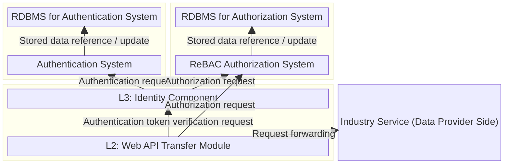
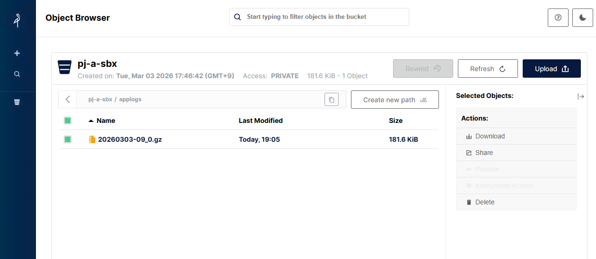

# ODS SDK for Onboarding Deployment Definition Files (for Docker Compose)

## Overview

This repository publishes deployment definition files for Docker Compose as one of the SDK for Onboarding provided by Open Dataspaces (hereinafter referred to as ODS).
By using these definition files, users can easily deploy the ODS components in their local environment and use it for development and operational verification.

## Prerequisites

The software published in this repository has been verified to operate in the following environment:

- Machine specifications: Core i7-1265U, 16 GiB memory, 500 GB SSD
- OS: Windows 11 + WSL2 (Ubuntu 24.04)
- Docker:
  - Client: 28.1.1-rd
  - Server: 27.3.1
  - Compose: 2.37.1

In addition, the following versions of ODS components are used.

* [Web API Transfer Module](https://github.com/open-dataspaces/L2-dp-webapi): [v1.0.0](https://github.com/open-dataspaces/L2-dp-webapi/tree/v1.0.0)
* [Identity Component](https://github.com/open-dataspaces/L3-identity-component): [v1.0.0](https://github.com/open-dataspaces/L3-identity-component/tree/v1.0.0)
* [Clearing and Payment Service](https://github.com/open-dataspaces/DCS-Payment): [v1.0.0](https://github.com/open-dataspaces/DCS-Payment/tree/v1.0.0)

## Repository Structure

The directory structure of this repository is as follows:

| File / Directory      | Description |
| --------------------- | ----------- |
| docker-compose.yml | Top-level deployment definition file that aggregates definitions for each component and allows them to be started and stopped collectively |
| l2 | Directory containing deployment definition files for the Web API Transfer Module, which is a component of L2 (Transaction Layer) |
| l3 | Directory containing deployment definition files for the Identity Component, which is a component of L3 (Identity Layer) |
| logging | Directory containing deployment definition files for the logging service |
| mockserver | Directory containing deployment definition files for a mock server used for operational verification |
| payment | Directory containing deployment definition files for the Clearing and Payment Service |
| setup | Collection of scripts to simplify and automate the setup procedure |

## Setup Procedure

### System Architecture Diagram

The components and services constructed by this SDK are shown below.  
Rectangles represent components or services, and arrows represent dependency relationships between them.



In this SDK, PostgreSQL is used as the RDBMS, Keycloak is used as the Authentication System,
and OpenFGA is used as the ReBAC Authorization System.

In the following sections, the Identity Component and the Web API Transfer Module
may be simply referred to as **L3** and **L2**, respectively.

Unless otherwise specified, all commands are assumed to be executed
from the root directory of this repository created by running `git clone`.

### Startup and Shutdown

The procedures for starting and stopping each component individually
are as follows.

#### L3: Identity Component

Startup

```
$ docker compose -f l3/docker-compose.yml up -d
```

Shutdown

```
$ docker compose -f l3/docker-compose.yml down
```

#### Logging Service

Startup

```
$ docker compose -f logging/docker-compose.yml up -d
```

Shutdown

```
$ docker compose -f logging/docker-compose.yml down
```

#### L2: Web API Transfer Module

Startup (L3 and the Logging Service must be started in advance)

```
$ docker compose up -d gateway 
```

Shutdown

```
$ docker compose -f l2/docker-compose.yml down
```

#### Clearing and Payment Service

Startup (Requires L3 to be started in advance)

```
$ docker compose -f payment/docker-compose.yml up -d
```

Shutdown

```
$ docker compose -f payment/docker-compose.yml down
```

### Configuration for SSL Inspection Environments

When using this repository in an SSL inspection environment, file downloads may fail during the container image build process.
In such cases, place the certificate required to pass the SSL inspection in `cert-file/cert.cer`,
and uncomment the corresponding sections in the Dockerfile.

The following four files require these changes.

- l2/Dockerfile
- l3/Dockerfile-local
- logging/Dockerfile
- payment/Dockerfile

### Initial Setup of Each Component

The initial setup procedures for each component are described below.

First, copy the L2, L3, and Clearing and Payment services from their respective official repositories.

```
$ git clone --branch=v1.0.0 --depth=1 https://github.com/open-dataspaces/L2-dp-webapi.git
$ git clone --branch=v1.0.0 --depth=1 https://github.com/open-dataspaces/L3-identity-component.git
$ git clone --branch=v1.0.0 --depth=1 https://github.com/open-dataspaces/DCS-Payment.git
```

Once all required files are in place, create a network shared by the service group,
and start all services using the `docker-compose.yml` file located at the top level of this repository.

```
$ docker network create shared-network-ods
$ docker compose up -d
```

When all services are running as shown below, the setup has been completed successfully

```
[+] Running 17/17
 ✔ gateway                      Built                                                            0.0s
 ✔ payment-app                  Built                                                            0.0s
 ✔ l3-app                       Built                                                            0.0s
 ✔ Volume "ods_pgdata"          Created                                                          0.0s
 ✔ Volume "ods_postgres_data"   Created                                                          0.0s
 ✔ Volume "ods_pgdata_openfga"  Created                                                          0.0s
 ✔ Container minio              Started                                                          1.0s
 ✔ Container postgres           Started                                                          1.1s
 ✔ Container fluentd            Started                                                          1.1s
 ✔ Container l3-app             Started                                                          1.0s
 ✔ Container payment-db         Healthy                                                         11.5s
 ✔ Container postgres-openfga   Started                                                          1.0s
 ✔ Container payment-app        Started                                                         12.0s
 ✔ Container keycloak           Started                                                          1.7s
 ✔ Container openfga            Started                                                          1.6s
 ✔ Container ods-minio-init-1   Started                                                          1.4s
 ✔ Container gateway            Started                                                          2.2s
```

From this state, perform the initial setup for each component.

#### L3: Identity Component

For L3, the initial setup described in [Service Startup](https://github.com/open-dataspaces/L3-identity-component/blob/develop/README_en.md#1-service-startup) and the [Reference Implementation Tutorial](https://github.com/open-dataspaces/L3-identity-component/blob/develop/docs/tutorials/tutorials_en.md) is required.

This SDK provides a script that executes all steps in the latter up to "[2. User Authentication System Verification](https://github.com/open-dataspaces/L3-identity-component/blob/develop/docs/tutorials/tutorials_en.md#2-user-authentication-system-verification)" in a single execution. The execution procedure is as follows.

```
$ cd setup
$ bash setup_l3.sh
$ cd -
$ docker compose -f l3/docker-compose.yml up -d
```

The two client IDs created in Keycloak by the above procedure (client system authentication and end-user authentication) are identical to those created in ["2. User Authentication System Verification" of the Reference Implementation Tutorial](https://github.com/open-dataspaces/L3-identity-component/blob/develop/docs/tutorials/tutorials_en.md#2-user-authentication-system-verification)

If you need to change these settings, edit `setup/setup_l3.sh`.

Next, execute the following commands to create the OpenFGA store and authorization model,
and reflect their contents in the L2 deployment definition file (`l2/docker-compose.yml`).

```
$ cd setup
$ bash setup_l2.sh
$ cd -
```

The store name created in OpenFGA by the above procedure is `"ODS-USER-STORE"`.
If you need to change this value, edit `setup/openfga/5-create-user-store.json`.

#### L2: Web API Transfer Module

By completing the above steps, the settings required to start L2
have already been reflected in the deployment definition files,
so no additional configuration is required.

## Operational Setup

### Preparation

The access token validity period is set to 60 seconds by default.
If this duration is too short, it can be extended as needed.

The following example shows how to extend the validity period to 300 seconds.

```
$ ADMIN_ACCESS_TOKEN=$(
  curl -s -X POST "http://localhost:8082/realms/master/protocol/openid-connect/token" \
    -H "Content-Type: application/x-www-form-urlencoded" \
    -d "grant_type=password" \
    -d "client_id=admin-cli" \
    -d "username=admin" \
    -d "password=password" | jq -r .access_token
)

$ curl -X PUT "http://localhost:8082/admin/realms/master" \
    -H "Authorization: Bearer ${ADMIN_ACCESS_TOKEN}" \
    -H "Content-Type: application/json" \
    -d '{"accessTokenLifespan": 300}'
```

### Data Configuration Required for Starting Operation

Follow the steps described in [L3 Reference Implementation Tutorial 2‑1. Creating Authentication Information (Operator Information, Individual Users, Client IDs)](https://github.com/open-dataspaces/L3-identity-component/blob/develop/docs/tutorials/tutorials_en.md#2-1-creation-of-authentication-information-operator-information--individual-users--client-ids), and execute the procedures from registering operator information through [2‑1‑5. Obtaining the Operator Client Secret](https://github.com/open-dataspaces/L3-identity-component/blob/develop/docs/tutorials/tutorials_en.md#2-1-5-retrieving-the-operator-client-secret).

For this procedure, specify `localhost:8080` as the destination host, set `$SYSTEM_CLIENT_SECRET` to the value defined in `l3/docker-compose.yml` shown below, set `API-Key` to `API-Key-Sample`, and specify `system-auth-sample` as the `client_id`.

```
KEYCLOAK_CREDENTIALS_TOKEN_INTROSPECT_CLIENT_SECRET
```

### Environment Configuration Between Components

To enable L2 to integrate with L3, set the URL of the authentication system (Keycloak)
in the following parameter in `l2/docker-compose.yml`.

In the `docker-compose.yml` file provided by this SDK, a value corresponding to the L3
configuration is already set.
If the URL of L3 is changed for any reason, update the parameter below accordingly.

```
KEYCLOAK_URL
```

### Industry Service Integration

The configuration required to integrate with an industry service on the data provider side
is described below.

In this procedure, an example is shown in which communication with a mock server,
prepared as a sample industry service, is permitted.

#### L3: Identity Component

##### Registering Tuples in the OpenFGA Store

Execute the following command to register authorization tuples for the industry service
in the OpenFGA store.

Specify the following values for the variables used in the command.

| Variable | Value |
|---|---|
| `$USER_STORE_ID` | The value configured for `FGA_STORE_ID` in `l2/docker-compose.yml` |

```
$ curl -i -X POST \
  http://localhost:8083/stores/$USER_STORE_ID/write \
  -H "Content-Type: application/json" \
  -d '{
  "writes": {
    "tuple_keys": [
      { "user": "group:endpoint-test-get#member",    "relation": "can_access", "object": "endpoint:test.get" },
      { "user": "group:endpoint-test-post#member",   "relation": "can_access", "object": "endpoint:test.post" },
      { "user": "group:endpoint-test-put#member",    "relation": "can_access", "object": "endpoint:test.put" },
      { "user": "group:endpoint-test-delete#member", "relation": "can_access", "object": "endpoint:test.delete" }
    ],
    "on_duplicate": "ignore"
  }
}'
```

Here, permission groups are created for each CRUD operation on the endpoints
exposed by the industry service.

For example, the first entry in `tuple_keys` means that users who are members of
the group `endpoint-test-get` have a relationship (`can_access`) that allows them
to access the target endpoint `test.get`.

The endpoint `test.get` specified in the object corresponds to the route defined
later in the L2 configuration, which represents the request forwarding destination
to the industry service.

Similarly, the second through fourth entries indicate that users who are members of
the groups `endpoint-test-post`, `endpoint-test-put`, and `endpoint-test-delete`
can access the endpoints `test.post`, `test.put`, and `test.delete`, respectively.


##### Granting Authorization to an Operator

Next, execute the following command to register the operator’s authorization
settings for the industry service in the store.

Specify the following values for the variables used in the command.

| Variable | Value |
|---|---|
| `$USER_STORE_ID` | The value configured for `FGA_STORE_ID` in `l2/docker-compose.yml` |
| `$USER_MODEL_ID` | The value configured for `FGA_MODEL_ID` in `l2/docker-compose.yml` |
| `$OPERATOR_ID` | The `operator_id` issued when registering the operator information

```
$ curl -i -X POST "http://localhost:8083/stores/$USER_STORE_ID/write" \
      -H "Content-Type: application/json" \
      -d '{
        "authorization_model_id": "'$USER_MODEL_ID'",
        "writes": {
          "tuple_keys": [
            {
              "user": "user:'$OPERATOR_ID'",
              "relation": "member",
              "object": "group:endpoint-test-post"
            }
          ]
        }
      }'
```

Here, the operator is added to a group that has permission to send POST requests
to the industry service.

When changing the permissions to be granted, replace the value of the `object`
property with the corresponding group and execute the command again.

Note that both the tuple registration to the OpenFGA store in the previous step
and this authorization configuration are performed by sending requests directly
to OpenFGA in L3.

If direct requests to OpenFGA are not possible, refer to
[L3 Reference Implementation Tutorial  
2‑4. Using Authorization Functions](https://github.com/open-dataspaces/L3-identity-component/blob/develop/docs/tutorials/tutorials_en.md#2-4-using-authorization-features)

#### L2: Web API Transfer Module


For L2, it is necessary to reflect information in `l2/docker-compose.yml`
(the OpenFGA store ID and authorization model ID), apply the changes,
and configure routing.

Regarding information reflection, if `setup/setup_l2.sh` has been executed
as part of the initial setup procedure, `l2/docker-compose.yml` is edited
automatically and no additional action is required.


If the OpenFGA store and authorization model were created without executing
`setup/setup_l2.sh`, specify the IDs of the created store and authorization model
in the following parameters in `l2/docker-compose.yml`.

```
FGA_STORE_ID=
FGA_MODEL_ID=
```

Restart L2 using the following command to apply the configuration changes.

```
$ docker compose up -d gateway 
```

Next, configure a route to forward requests to the industry service.

In this example, a route configuration is shown that allows POST requests
only to a mock server. Execute the following command.

```
$ curl -X POST\
    -H "Content-Type: application/json"\
    -H "X-API-KEY: your-secret-management-api-key"\
    -d '{
    "id": "route01",
    "uri": "http://mockoon:4011/test",
    "predicates": [{
        "name": "Path",
        "args": {
        "_genkey_0": "/test**"
         }
     },
      { 
        "name": "Method",
        "args": { 
        "_genkey_0": "POST"
         }
      }],
    "metadata": {
      "endpointId": "test.post"
     }    
    }'\
    http://localhost:8090/actuator/gateway/routes/route01
```


By executing the above command, requests sent by data consumers to
`http://(L2 FQDN)/test` are forwarded to the industry service URL
specified in the `uri` field (in this example, `http://mockoon:4011/test`).

The value `test.post` specified as `endpointId` in the metadata corresponds
to the endpoint `endpoint:test.post` that was registered as an object in OpenFGA.

As a result, users who belong to the OpenFGA group `group:endpoint-test-post`
are allowed to send POST requests to this URL.

When registering a route, it is also possible to modify the exposed path,
add or remove headers, and perform other customizations.

Refer to the example below and add any required settings to the request payload
shown above.

```
    "filters": [
    {
        "name": "RewritePath",
        "args": {
        "_genkey_0": "/externally-exposed-path/(?<segment>.*)",
        "_genkey_1": "/${segment}"
         }
    },
    {
        "name": "AddRequestHeader",
        "args": {
            "name": "Custom header name used by the industry service",
            "value": "Custom value"
        }
    },
    {
        "name": "RemoveRequestHeader",
        "args": {
        "name": "Header name not required by the industry service"
         }
    }],
```

#### Data Consumer

Data consumers must include the following HTTP headers in their requests.
The headers required to access the industry service are as follows.

| Header Name | Description |
| ---: | --- |
| API-Key | API key issued by this service |
| Authorization | Access token issued by L3 (Identity Component) (JWT format) |
| X-TrackingId | Log output field for traceability management (UUID format) |
| X-ODS-xxx | Fields subject to logging. Specify `xxx` with a string designated by the service provider (e.g., `X-ODS-UserId`) |

#### Data Provider

Data providers start the industry service corresponding to the configured routing settings.

In this procedure, a mock server is used as an example.
The startup command is as follows.

```
$ docker compose -f mockserver/docker-compose.yml up -d
```

### Data Exchange

The following procedure describes how to perform data exchange between
consumers and providers using the components deployed by the deployment
definition files in this repository, as well as the industry services
integrated with them.

1. Obtain an access token
   Execute the procedure described in [L3 Reference Implementation Tutorial 2‑2‑1. Access Token Acquisition (Client Authentication)](https://github.com/open-dataspaces/L3-identity-component/blob/develop/docs/tutorials/tutorials_en.md#2-2-1-obtaining-an-access-token-operator-client-id-authentication) to obtain an access token.
   Specify `localhost:8080` as the destination host and set `API-Key` to `API-Key-Sample`.

2. Data access  
   Perform data access using the obtained access token.
   To send a POST request to the industry service configured in the
   route registration, execute the following command:

    ```
    $ curl -X POST "http://localhost:8090/test" \
      -H 'api-key: 2dfd3409-ce01-4451-96fa-7e10c9681422y' \
      -H "Authorization: bearer $ACCESS_TOKEN" \
      -H 'X-ODS-UserId: 112233' \
      -H "Content-Type: application/json" \
      -H "Prefer: return=representation" \
      -d '{"userid":112233}' | jq .
    ```

    A response similar to the following is returned from the `/test` endpoint.

    ```
    {
      "message": "Request successfully delivered!"
    }
    ```

### Clearing and Payment

The Clearing and Payment Service provides functions to calculate and present
payment and billing amounts for both consumers and providers based on the
usage fee models registered by data providers and the history of data exchanges
conducted between consumers and providers.

In addition, the service integrates with external services to perform actual
payment processing.
Transaction records are registered by both consumers and providers, and are
cross-checked with log information collected from the Web API Transfer Module
to ensure validity.

For details, refer to the [Clearing and Payment Service documentation](https://github.com/open-dataspaces/DCS-Payment).

#### Preparation

1. Execute database migrations for the Clearing and Payment Service.

```
$ cd DCS-Payment
$ docker compose exec payment-app alembic -c migrations/alembic.ini upgrade head

...

INFO  [alembic.runtime.migration] Context impl PostgresqlImpl.
INFO  [alembic.runtime.migration] Will assume transactional DDL.
INFO  [alembic.runtime.migration] Running upgrade  -> 001_initial, Initial tables (unified schema)
$ cd -
```

2. Set the same value as `KEYCLOAK_CREDENTIALS_TOKEN_INTROSPECT_CLIENT_SECRET`
   defined in `l3/docker-compose.yml` for the following parameter in
   `payment/docker-compose.yml`, and restart the Clearing and Payment Service
   to apply the change.

   For simplicity, the authorization feature of the Clearing and Payment Service
   is disabled in this example.
   In a production environment, configure the authorization feature appropriately
   by referring to the [Clearing and Payment Service documentation](https://github.com/open-dataspaces/DCS-Payment).

```
L3_CLIENT_SECRET
```

```
$ docker compose up payment-app -d
```

3. Register a dummy payment service for verification purposes in advance, along with the associated data provider and data consumer, in the database.
   For simplicity, the same ID is used for both the data provider and the data consumer in this example.
   Also, store the ID of the registered service in a variable for later use.

```
$ PAYMENT_SERVICE_ID=$(uuidgen -t)
$ docker exec -it payment-db psql fastapi_db -U postgres -c "INSERT INTO payment_services VALUES ('$PAYMENT_SERVICE_ID', 'test_service', 'http://example.com/')"
INSERT 0 1
$ docker exec -it payment-db psql fastapi_db -U postgres -c 'SELECT * FROM payment_services'
          payment_service_id          | payment_service_name | payment_service_url |          created_at           |          updated_at           
--------------------------------------+----------------------+---------------------+-------------------------------+-------------------------------
 e5a8e2ee-28cf-11f1-bd41-5847ca798141 | test_service         | http://example.com/ | 2026-03-26 04:54:44.932769+00 | 2026-03-26 04:54:44.932769+00
(1 row)

$ docker exec -it payment-db psql fastapi_db -U postgres -c "INSERT INTO payment_service_user_registrations VALUES ('$OPERATOR_ID', '$PAYMENT_SERVICE_ID', '$OPERATOR_ID', '$OPERATOR_ID')"
INSERT 0 1
$ docker exec -it payment-db psql fastapi_db -U postgres -c '\x' -c 'SELECT * FROM payment_service_user_registrations'
Expanded display is on.
-[ RECORD 1 ]-----------+-------------------------------------
payment_service_user_id | e6393807-ff52-4985-bf15-7f9f98adf0b1
payment_service_id      | e5a8e2ee-28cf-11f1-bd41-5847ca798141
consumer_id             | e6393807-ff52-4985-bf15-7f9f98adf0b1
provider_id             | e6393807-ff52-4985-bf15-7f9f98adf0b1
company_name            | 
department              | 
customer_name           | 
zip_code                | 
address                 | 
tel_no                  | 
external_buyer_id       | 
external_data           | 
created_at              | 2026-03-26 05:13:11.181819+00
updated_at              | 2026-03-26 05:13:11.181819+00
```

4. Obtain an access token
   Execute [L3 Reference Implementation Tutorial 2‑2‑1. Access Token Acquisition (Client Authentication)](https://github.com/open-dataspaces/L3-identity-component/blob/develop/docs/tutorials/tutorials_en.md#2-2-1-obtain-access-token-operator-client-id-authentication) to obtain an access token.
   Specify `localhost:8080` as the destination host and set `API-Key` to `API-Key-Sample`.

#### Registering a Usage Fee Model (Provider)

In this example, the same ID is used for both the consumer and the provider.

Send the following request to register a usage fee model
with the Clearing and Payment Service.

```
$ curl -X POST \
  -H "Content-Type: application/json" \
  -H "Authorization: Bearer $ACCESS_TOKEN" \
  -H "X-TrackingId: $(uuidgen -t)" \
  -H "x-payment-api-key: payment-api-key" \
  -d '{
    "fee_model_name": "standard-model",
    "price": 1000,
    "tax_classification": "taxable",
    "tax_rate": 0.10,
    "provider_id": "'"$OPERATOR_ID"'",
    "consumer_id": "'"$OPERATOR_ID"'",
    "data_id": "'"I0101"'",
    "payment_service_id": "'"$PAYMENT_SERVICE_ID"'",
    "valid_from": "'$(date -Iseconds -u)'",
    "is_active": true,
    "version": 1
  }' \
  localhost:8001/api/v1/fee-model
```

If the request is successful, a response similar to the following is returned.

```
{
  "created_at": "2026-03-26T04:58:12.754643Z",
  "updated_at": "2026-03-26T04:58:12.754643Z",
  "valid_from": "2026-03-26T04:58:12Z",
  "is_active": true,
  "version": 1,
  "storage_type": "provider_env",
  "storage_key": "",
  "valid_to": null,
  "provider_id": "e6393807-ff52-4985-bf15-7f9f98adf0b1",
  "consumer_id": "e6393807-ff52-4985-bf15-7f9f98adf0b1",
  "data_id": "I0101",
  "payment_service_id": "e5a8e2ee-28cf-11f1-bd41-5847ca798141",
  "fee_model_name": "standard-model",
  "price": "1000.00",
  "tax_classification": "taxable",
  "tax_rate": "0.1000",
  "fee_model_id": "86b4794b-678e-46bb-a9ba-1c7c3e90fe87"
}
```

#### Retrieving the Usage Fee Model List (Provider)

The registered usage fee models can be confirmed using the following request.

```
$ curl -s \
  -H "Content-Type: application/json" \
  -H "Authorization: Bearer $ACCESS_TOKEN" \
  -H "X-TrackingId: $(uuidgen -t)" \
  -H "x-payment-api-key: payment-api-key" \
  localhost:8001/api/v1/fee-model
```

If the request is successful, a response similar to the following is returned.

```
{
  "models": [
    {
      "created_at": "2026-03-26T04:58:12.754643Z",
      "updated_at": "2026-03-26T04:58:12.754643Z",
      "valid_from": "2026-03-26T04:58:12Z",
      "is_active": true,
      "version": 1,
      "storage_type": "provider_env",
      "storage_key": "",
      "valid_to": null,
      "provider_id": "e6393807-ff52-4985-bf15-7f9f98adf0b1",
      "consumer_id": "e6393807-ff52-4985-bf15-7f9f98adf0b1",
      "data_id": "I0101",
      "payment_service_id": "e5a8e2ee-28cf-11f1-bd41-5847ca798141",
      "fee_model_name": "standard-model",
      "price": "1000.00",
      "tax_classification": "taxable",
      "tax_rate": "0.1000",
      "fee_model_id": "86b4794b-678e-46bb-a9ba-1c7c3e90fe87"
    }
  ]
}
```

#### Registering Data Exchange Status (Consumer and Provider)

When a data exchange is completed, both the data consumer and the data provider
register the transaction record with the Clearing and Payment Service.

The target data exchange is identified by the value of the `X-TrackingId` header
used at the time of the exchange. In this example, a dummy value is used.

```
$ export TRACKING_ID=$(uuidgen -t)
$ curl -X POST \
  -H "Content-Type: application/json" \
  -H "Authorization: Bearer $ACCESS_TOKEN" \
  -H "X-TrackingId: $(uuidgen -t)" \
  -H "x-payment-api-key: payment-api-key" \
  -d '{
    "tracking_id": "'"$TRACKING_ID"'",
    "provider_id": "'"$OPERATOR_ID"'",
    "consumer_id": "'"$OPERATOR_ID"'",
    "data_id_list": ["I0101"],
    "completed_at": "'$(date -Iseconds -u)'",
    "status": "completed"
  }' \
  localhost:8001/api/v1/data-exchange/status
```

If the registration is successful, the following response is returned.

```
{"status":"success","detail":"Data exchange status registered"}
```

#### Retrieving Scheduled Payment Amount (Consumer)

Consumers can check the scheduled payment amount for the current day
using the following request.

```
$ curl -X POST \
  -H "Content-Type: application/json" \
  -H "Authorization: Bearer $ACCESS_TOKEN" \
  -H "X-TrackingId: $(uuidgen -t)" \
  -H "x-payment-api-key: payment-api-key" \
  -d '{
    "provider_id": "'"$OPERATOR_ID"'",
    "start_date": "'$(date -I)'",
    "end_date": "'$(date -I -d'+1 day')'"
  }' \
  localhost:8001/api/v1/payment
```

If the request is successful, a response similar to the following is returned.

```
{
  "payment_details": [
    {
      "tracking_id": "a6c0c488-28d0-11f1-bd41-5847ca798141",
      "fee_model_id": "86b4794b-678e-46bb-a9ba-1c7c3e90fe87",
      "payment_service_id": "e5a8e2ee-28cf-11f1-bd41-5847ca798141",
      "provider_id": "e6393807-ff52-4985-bf15-7f9f98adf0b1",
      "consumer_id": "e6393807-ff52-4985-bf15-7f9f98adf0b1",
      "data_id_list": [
        "I0101"
      ],
      "completed_at": "2026-03-26T05:51:57Z",
      "amount": 1100.0,
      "tax_rate": 0.1
    }
  ],
  "total_amount": 1100.0
}
```

#### Retrieving Scheduled Billing Amount (Provider)


Providers can check the scheduled billing amount for the current day
using the following request.


```
$ curl -X POST \
  -H "Content-Type: application/json" \
  -H "Authorization: Bearer $ACCESS_TOKEN" \
  -H "X-TrackingId: $(uuidgen -t)" \
  -H "x-payment-api-key: payment-api-key" \
  -d '{
    "consumer_id": "'"$OPERATOR_ID"'",
    "start_date": "'$(date -I)'",
    "end_date": "'$(date -I -d'+1 day')'"
  }' \
  localhost:8001/api/v1/billing
```

If the request is successful, a response similar to the following is returned.

```
{
  "billing_details": [
    {
      "tracking_id": "a6c0c488-28d0-11f1-bd41-5847ca798141",
      "fee_model_id": "86b4794b-678e-46bb-a9ba-1c7c3e90fe87",
      "payment_service_id": "e5a8e2ee-28cf-11f1-bd41-5847ca798141",
      "provider_id": "e6393807-ff52-4985-bf15-7f9f98adf0b1",
      "consumer_id": "e6393807-ff52-4985-bf15-7f9f98adf0b1",
      "data_id_list": [
        "I0101"
      ],
      "completed_at": "2026-03-26T05:51:57Z",
      "amount": 1100.0,
      "tax_rate": 0.1
    }
  ],
  "total_amount": 1100.0
}
```

### Monitoring

The types of logs output by each component and service are as follows.

#### L2: Web API Transfer Module

Logs output by L2 are stored in object storage by the logging service.

The default output destination is shown below.
To change this location, edit `logging/docker-compose.yml`.

| Output Path | Description |
| ------------------ | ----------- |
| data/pj-a-sbx/applogs | Log files are rotated on an hourly basis |


In addition to directly accessing the directory, these logs can also be viewed
via a web browser by accessing the MinIO console.

Access the console at http://localhost:9001/login and enter the user name and password.


- Username: minio-sample
- Password: XXXXXXXXXXXXXXXXXXXXXXXXXXXXXXXXX
These user names and passwords can be changed by editing `logging/.env`.

After a successful login, you can view the stored logs.
The directory structure follows the storage hierarchy and is `pj-a-sbx/applogs`.


Since log files are stored under the `applogs` directory, you can download and
extract them to review their contents.



#### L3: Identity Component

L3 outputs logs to standard output and standard error.
When running in a container, logs can be checked using the following command.

```
$ docker logs l3-app
```

#### Clearing and Payment Service

The Clearing and Payment Service outputs logs to standard output and standard error.
When running in a container, logs can be checked using the following command.

```
$ docker logs payment-app
```

## License

- This repository is provided under the MIT License.
- The copyright of the source code and related documentation belongs to NTT DATA Group Corporation and NTT DATA Corporation.

## Disclaimer

- The contents of this repository may be changed or removed without prior notice.
- No responsibility is assumed for any losses or damages arising from the use of this repository.
